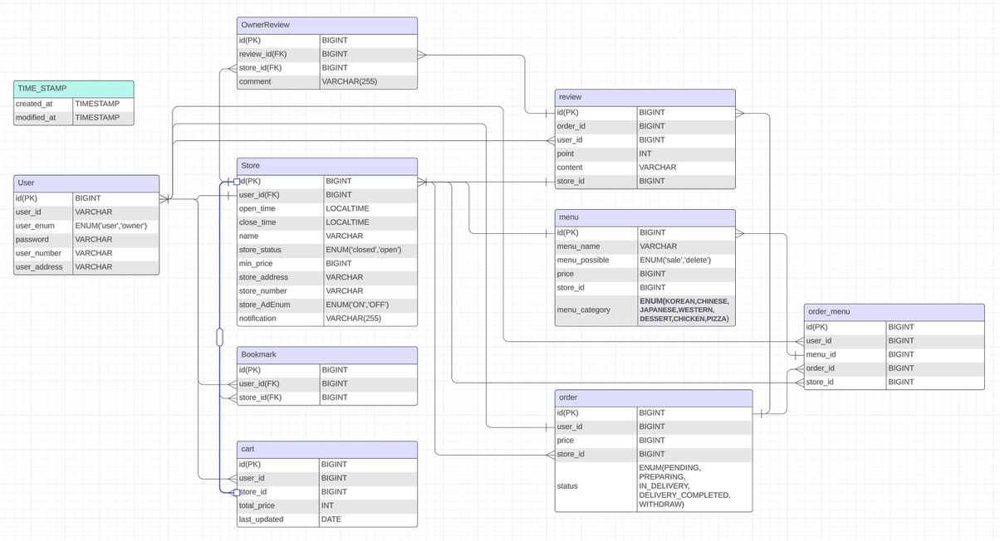

# ERD

# API 명세서

### **User**

| 기능         | Method | Endpoint          | Request Body                                                                                            | Headers                         | Response                                                                                                      |
|------------|--------|-------------------|---------------------------------------------------------------------------------------------------------|---------------------------------|---------------------------------------------------------------------------------------------------------------|
| `회원가입`     | `POST` | `/api/auth/signup` | `{ "username": "string", "password": "string", "email": "string" }`                                     | `Authorization: Bearer <token>` | `200 OK`                                                                                                      |
| `로그인`      | `POST` | `/api/auth/login` | `{ "username": "string", "password": "string" }`                                                        | `Authorization: Bearer <token>` | `200 OK`                                                                                                      | 
| `회원 정보 조회` | `GET`  | `/api/users` |                                                                                                         | `Authorization: Bearer <token>` | `{ "id": 1, "email": "user@example.com", "username": "exampleuser", "location": "Seoul","userEnum": "USER" }` | 
| `회원 정보 수정` | `PUT`  | `/api/users` | `{ "id": 1, "email": "user@example.com", "username": "exampleuser", "location": "Seoul","userEnum": "USER" }` | `Authorization: Bearer <token>` | `{ "id": 1, "email": "user@example.com", "username": "exampleuser", "location": "Seoul","userEnum": "USER" }` | 
| `회원 탈퇴`    | `POST` | `/api/users` | `{ "email": "user@example.com", "password": "examplepassword"}`| `Authorization: Bearer <token>` | `200 OK` |

### **Store**

| 기능                   | Method | Endpoint                              | Request Body                                                                                                     | Headers                         | Response                                                                                                      |
|------------------------|--------|---------------------------------------|------------------------------------------------------------------------------------------------------------------|---------------------------------|---------------------------------------------------------------------------------------------------------------|
| `가게 생성`            | `POST` | `/api/stores`                         | `{ "storeName": "string", "location": "string", "minPrice": 10000 }`                                            | `Authorization: Bearer <token>` | `200 OK`, StoreResponseDto                                                                                   |
| `가게 정보 수정`       | `PUT`  | `/api/stores/{storeId}`              | `{ "storeName": "string", "location": "string", "minPrice": 10000 }`                                            | `Authorization: Bearer <token>` | `200 OK`, StoreResponseDto                                                                                   |
| `가게 상세 조회`       | `GET`  | `/api/stores/{storeId}`               | `None`                                                                                                          | `Authorization: Bearer <token>` | `200 OK`, StoreDetailResponseDto                                                                               |
| `가게 목록 조회`       | `GET`  | `/api/stores`                         | `{ "location": "string", "category": "string" }`                                                                | `Authorization: Bearer <token>` | `200 OK`, List<StoreResponseDto>                                                                              |
| `가게 영업 종료`       | `PUT`  | `/api/stores/{storeId}/close`        | `None`                                                                                                          | `Authorization: Bearer <token>` | `200 OK`, `"store is closed successfully"`                                                                    |
| `가게 광고 상태 변경`  | `PUT`  | `/api/stores/{storeId}/ad`           | `None`                                                                                                          | `Authorization: Bearer <token>` | `200 OK`, `"ad condition changed successfully"`                                                               |
| `내 가게 일별/월별 조회`| `GET`  | `/api/stores/mystore`                 | `None` (query params: `type`, `startDate`, `endDate`)                                                          | `Authorization: Bearer <token>` | `200 OK`, List<StoreCheckResponseDto>                                                                        |
| `가게 공지 변경`       | `PUT`  | `/api/stores/{storeId}/notification` | `{ "notification": "string" }`                                                                                 | `Authorization: Bearer <token>` | `200 OK`, StoreNotificationResponseDto                                                                         |
| `가게 즐겨찾기 추가`   | `POST` | `/api/stores/{storeId}/bookmarkon` | `None`       | `Authorization: Bearer <token>` | `200 OK`, BookmarkSaveResponseDto                                      |
| `가게 즐겨찾기 삭제`   | `DELETE` | `/api/stores/{storeId}/bookmarkoff` | `None`       | `Authorization: Bearer <token>` | `204 No Content` (No response body)                                   |
| `사장님 댓글 추가`     | `POST` | `/api/stores/{storeId}/review/{reviewId}/ownerReview` | `{ "comment": "string" }`                                     | `Authorization: Bearer <token>` | `200 OK`, OwnerReviewResponseDto                                      |
| `사장님 댓글 수정`     | `PUT`  | `/api/stores/ownerReview/{ownerReviewId}` | `{ "comment": "string" }`                                     | `Authorization: Bearer <token>` | `200 OK`, OwnerReviewResponseDto                                      |
| `사장님 댓글 삭제`     | `DELETE` | `/api/stores/ownerReview/{ownerReviewId}` | `None`                                                        | `Authorization: Bearer <token>` | `204 No Content` (No response body)                                   |
| `가게 검색 (이름 또는 메뉴)` | `GET`  | `/api/stores/search`          | `None`       | `None`                          | `200 OK`, List of StoreSimpleResponseDto                 |
| `가게 검색 (카테고리)`     | `GET`  | `/api/stores/category`        | `None`       | `None`                          | `200 OK`, List of StoreCategoryResponseDto               |

### **Menu**

| 기능               | Method | Endpoint                           | Request Body                                         | Headers                         | Response                               |
|--------------------|--------|------------------------------------|------------------------------------------------------|---------------------------------|----------------------------------------|
| `메뉴 저장`         | `POST` | `/api/stores/{storeId}/menus`     | `{ "name": "string", "price": 1000, "description": "string" }` | `Authorization: Bearer <token>` | `200 OK`, "menu save complete."        |
| `메뉴 수정`         | `PUT`  | `/api/stores/{storeId}/menus/{menuId}` | `{ "name": "string", "price": 1500, "description": "string" }` | `Authorization: Bearer <token>` | `200 OK`, "menu update complete."      |
| `메뉴 삭제`         | `DELETE` | `/api/stores/{storeId}/menus/{menuId}` | `None`                                             | `Authorization: Bearer <token>` | `200 OK`, "menu delete complete."      |
### **Order** 

| 기능               | Method | Endpoint                        | Request Body                                      | Headers                         | Response                             |
|--------------------|--------|---------------------------------|---------------------------------------------------|---------------------------------|--------------------------------------|
| `주문 생성`         | `POST` | `/api/orders/{storeId}`        | `None`                                           | `Authorization: Bearer <token>` | `200 OK`, "order success"            |
| `주문 상태 변경`    | `PUT`  | `/api/orders/store/{storeId}/order/{orderId}` | `{ "orderStatus": "PREPARING" }`                  | `Authorization: Bearer <token>` | `200 OK`, "change order status success" |
| `주문 조회`         | `GET`  | `/api/orders/{orderId}`        | `None`                                           | `Authorization: Bearer <token>` | `{ "id": 1, "status": "PREPARING", ... }` |
| `장바구니에 메뉴 추가` | `POST` | `/api/carts/store/{storeId}` | `{ "menuId": 1, "quantity": 2 }`                | `Authorization: Bearer <token>` | `{ "cartId": 1, "items": [...] }`  |
| `장바구니 조회`      | `GET`  | `/api/carts`                | `None`                                           | `Authorization: Bearer <token>` | `{ "cartId": 1, "items": [...] }`  |
| `장바구니 비우기`     | `DELETE` | `/api/carts`                | `None`                                           | `Authorization: Bearer <token>` | `{ "cartId": 1, "items": [] }`     |
| `장바구니에서 메뉴 제거`| `DELETE` | `/api/carts/menu/{menuId}`  | `None`                                           | `Authorization: Bearer <token>` | `{ "cartId": 1, "items": [...] }`  |

### **Review**

| 기능                | Method | Endpoint                              | Request Body                                              | Headers                         | Response                                        |
|---------------------|--------|---------------------------------------|-----------------------------------------------------------|---------------------------------|-------------------------------------------------|
| `리뷰 생성`           | `POST` | `/api/reviews/store/{storeId}/order/{orderId}` | `{ "rating": 5, "comment": "Excellent service!" }`      | `Authorization: Bearer <token>` | `{ "reviewId": 1, "rating": 5, "comment": "Excellent service!" }` |
| `리뷰 수정`          | `PUT`  | `/api/reviews/{reviewId}`            | `{ "rating": 4, "comment": "Good service!" }`           | `Authorization: Bearer <token>` | `{ "reviewId": 1, "rating": 4, "comment": "Good service!" }`     |
| `리뷰 삭제`          | `DELETE` | `/api/reviews/{reviewId}`            | `None`                                                   | `Authorization: Bearer <token>` | `"성공적으로 삭제되었습니다."`                         |
| `리뷰 조회`          | `GET`  | `/api/reviews/store/{storeId}`       | `None`                                                   | `None`                          | `{ "content": [...], "totalPages": 3, "totalElements": 30 }`      |
